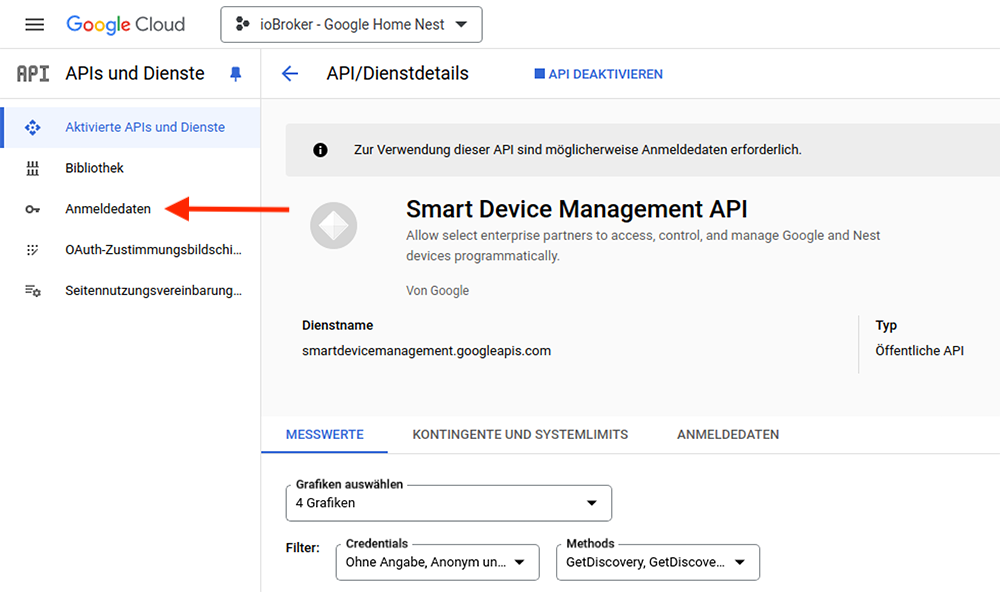
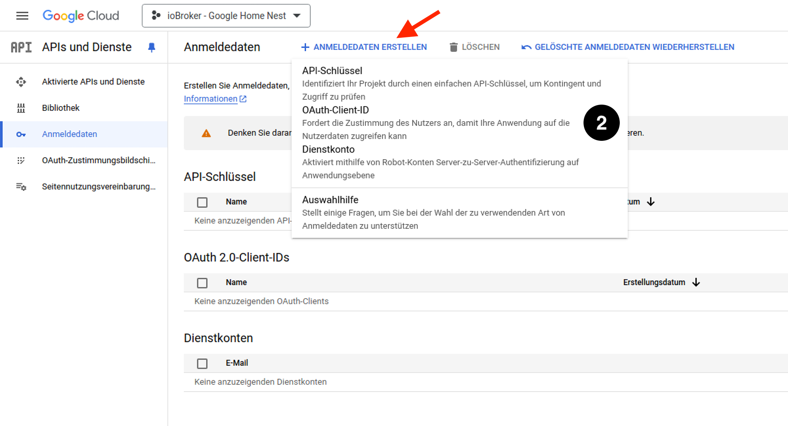

# ioBroker.google-home-nest

> [!NOTE]
> This is the documentation in German. 
> You can find the English version here: [🇬🇧 English documentation](../en/adapter_setup.md)

## Übersicht **'Admin Panel'**

.png)

|                                                               |                            |                                                                                                                            |
| ------------------------------------------------------------- | -------------------------- | -------------------------------------------------------------------------------------------------------------------------- |
|        | **Basis-Einrichtung**      | Die in der Übersicht mit roten Kreisen gekennzeichneten Bereiche sind für die **Basis-Einrichtung** erforderlich.       |
|  | **Erweiterte-Einrichtung** | Die in der Übersicht mit gelben Kreisen gekennzeichneten Bereiche sind für die **Erweiterte-Einrichtung** erforderlich. |

## Basis-Einrichtung

1. Für die **Basis-Einrichtung** muss zunächst unter Punkt 1 ein Port für den HTTP-Server ausgewählt werden. 

> [!IMPORTANT]
> Stelle sicher, dass der ausgewählte Port nicht bereits von einer anderen Anwendung oder einem anderen Prozess verwendet wird und auch nicht durch eine Firewall blockiert ist.

2. Anschließend müssen die Werte 2-4 eingetragen werden. Wie Du an diese Werte kommst wird in den nächsten Abschnitten beschrieben. 

3. Nach der Eingabe der erforderlichen Daten können diese mit einem Klick auf **'SPEICHERN'** gespeichert werden. 

4. Als nächstes muss der Adapter gestartet werden. 
   Der Adapter wird unmittelbar nach dem Start versuchen einen HTTP-Server zu erstellen der den unter Punkt 1 angegebenen Port auf eingehende Kommunikation überwacht. 

> [!IMPORTANT]
> Um den nachfolgenden Schritt erfolgreich abschließen zu können ist es zwingend erforderlich das der Adapter und damit der HTTP-Server gestartet wurde und der HTTP-Server den angegebenen Port überwachen kann.

> [!IMPORTANT]
> Um den folgenden Schritt erfolgreich abschließen zu können, muss dieser zwingend von einem Browser auf demselben Gerät ausgeführt werden, auf dem der ioBroker installiert ist.

5. Nun kann mit einem Klick auf den **'Authentifizieren'** Button im Bereich **'Authentifizierung'** des **'Admin Panel'** die Authentifizierung gestartet werden.

## **'OAuth-Client-ID'** erwerben

Um eine **'OAuth-Client-ID'** zu erhalten muss zunächst ein Google Cloud Projekt angelegt werden.

1. Rufe in deinem Browser die [Google Cloud Console](https://console.cloud.google.com/) auf. 
> [!TIP]
> Die **'Google Cloud Console'** kann auch über die Adresse 'https://console.cloud.google.com/' oder einem Klick auf einer der entsprechenden Button im **'Admin Panel'** aufgerufen werden.

2. Wenn Du die **'Google Cloud Console'** zum ersten Mal aufrufst, wirst Du nun aufgefordert die Nutzungsbedingungen für die **'Google Cloud Platform'** zu akzeptieren.
   
   
   Um fortzufahren, stimme den Nutzungsbedingungen zu.
> [!IMPORTANT]
> Achte darauf, das Du mit demselben Google Konto eingeloggt bist, mit dem auch deine Google (Nest) Geräte verknüpft sind.

3. Als nächstes muss in der **'Google Cloud Console'** ein neues Projekt angelegt werden. 
   Klicke dazu im oberen Bereich der **'Google Cloud Console'** auf das Auswahlmenü 'Projekt auswählen'.
   

4. Wähle nun im sich öffnenden Popup-Fenster **'Neues Projekt'** aus um ein neues Projekt anzulegen.
   

5. Nun muss das neue Projekt konfiguriert werden. 

   Hierfür muss ein gültiger **'Projektname'** und eine gültige **'Projekt-ID'** vergeben werden. 
    
   Der **'Projektname'** dient allein zur Identifizierung des Projekts in deiner Projektbibliothek. 
   Die **'Projekt-ID'** hingegen indentifiziert dein Projekt auf 'globaler' Ebene und muss daher eindeutig sein und kann nachträglich nicht geändert werden. 
    
   Beim Öffnen der Seite für die Projekterstellung enthält das Textfeld **'Projektname'** bereits einen Vorschlag für den Projektnamen. 
   Ebenfalls wird bereits eine eideutige **'Projekt-ID'** angezeigt, die mit einem Klick auf den Button **'BEARBEITEN'** geändert werden kann. 
    
   Ein **'Speicherort'** muss nicht zwingend angegeben werden.

   

   Nachdem Du dich für einen **'Projektnamen'** entschieden und eine eindeutige **'Projekt-ID'** vergeben hast, klicke auf den Button **'ERSTELLEN'** um das Projekt anzulegen.

> [!TIP]
> Es bietet sich an einen eigenen **'Projektnamen'** zu vergeben, um das Projekt in Zukunft einfacher identifizieren zu können. 
> z.B.: '*ioBroker - Google Home Nest*' (wie im folgendem Bild zu sehen).

> [!TIP]
> Da die **'Projekt-ID'** dein Google Cloud Projekt unter allen Google Cloud Projekten eindeutig identifiziert und daher unter allen Google Cloud Projekten eindeutig sein muss,
> bietet es sich an der **'Projekt-ID'** eine persönliche Komponente zu verleihen. 
> Dein Name oder Teile deines Namens, dein Spitzname oder deine Domain (falls vorhanden) sind gute Beispiele für persönliche Komponenten für die **'Projekt-ID'**.
> Es spricht aber auch nichts dagegen, einfach die vorgeschlagene **'Projekt-ID'** zu übernehmen. Unter Umständen ist dies sogar die einfachste Option.

6. Wähle nun im Dropdown-Menü dein neu angelegtes Projekt aus und gehe dann zum **'Dashboard'** des Projekts. 
   
   Folge hierfür die Schritte 1-4 im unteren Bild.

   

7. Auf dem **'Dashboard'** des Projekts findest du nun im Bereich **'Projektinformationen'** deinen **'Projektnamen'**, deine **'Projektnummer'** und deine **'Projekt-ID'**. 
   

> [!NOTE]
> Die **'Projekt-ID'** benötigst Du für die **Erweiterte Einrichtung** und ist für die **Basis-Einrichtung** nicht erforderlich.

> [!IMPORTANT]
> Bei der **'Projekt-ID'** (wie im unteren Bild zu sehen) handelt es sich um die **'Google Cloud - Projekt-ID'**. 
> Diese ist bitte nicht mit der **'Google - Device Access Console - Projekt-ID'** zu verwechseln, die Du für die **Basis-Einrichtung** benötigst und im **'Admin Panel'** unter **Punkt 3** einzutragen ist.

8. Nachdem Du nun erfolgreich das Projekt in der **'Google Cloud Console'** angelegt hast, muss als nächstes die **'Smart Device Management API'** aktiviert werden. 

   Stelle hierfür sicher das im Dropdown-Menü dein neu angelegtes Projekt ausgewählt ist (Schritt 1 im unteren Bild) und folge dann den Schritten 2-4.

   

9. Klicke nun auf der folgenden Seite auf **'+ APIS UND DIENSTE AKTIVIEREN'**.
   

10. Nutze die Suchleiste auf der folgenden Seite um die Google **'API Bibliothek'** nach der **'Smart Device Management API'** zu durchsuchen.
    

11. Wähle die **'Smart Device Management API'** aus den Suchergebnissen aus.
    

12. Klicke auf der Seite der **'Smart Device Management API'** auf den Button **'AKTIVIEREN'** um die API zu aktivieren.
    

13. Nachdem nun die **'Smart Device Management API'** aktiviert ist, müssen die Anmeldedaten erstellt werden. 

    Klicke dazu zunächst im Menü auf der linken Seite auf **'Anmeldedaten'** um die entsprechende Seite aufzurufen.
    

14. Klicke auf der Seite der **'Anmeldedaten'** in der oberen Menüzeile auf den Button **'+ ANMELDEDATEN ERSTELLEN'** und dann auf **'OAuth-Client-ID'** (Schritt 2 im unteren Bild).
    

15. Wenn Du gerade erst ein neues Projekt angelegt hast, wird dir nun angezeigt dass Du vor dem erstellen einer **'OAuth-Client-ID'** zuerst den Zustellungsbildschirm konfigurieren musst. 

    Dies kannst du mit einem Klick auf den Button **'ZUSTIMMUNGSBILDSCHIRM KONFIGURIEREN'** nun tun.

    

16. Wähle nun auf der nächsten Seite **'Extern'** für den **'User Type'** aus und klicke anschließend auf den Button **'ERSTELLEN'**
    

18. Auf der nächsten Seite müssen nun einige Angaben für den **'Zustimmungsbildschirm'** gemacht werden.

    | Punkt | Feldname                                         | verpflichtend? | Beschreibung                                                                                                                 |
    | ----- | ------------------------------------------------ | -------------- | ---------------------------------------------------------------------------------------------------------------------------- |
    | 1     | Anwendungsname                                   | Ja             | Gebe hier einen Namen für die um Zustimmung bittende Anwendung ein. Zum Beispiel: *'ioBroker Adapter: Google-Home-Nest'*  |
    | 2     | Nutzersupport E-Mail                             | Ja             | Hier wählst Du deine E-Mail Adresse aus dem Dropdown Menü aus                                                                |
    | 3     | E-Mail Adressen (Kontaktdaten des Entwicklers | Ja             | Hier gibst Du erneut deine E-Mail Adresse ein                                                                                |
    | 4     | Hochzuladene Logodatei                           | Nein           | Hier kann ein Logo für die um Zustimmung bittende Anwendung hochgeladen werden. Dies ist nicht verpflichtend und kann ausgelassen werden. Falls erwünscht kann hier aber z.B. das Adapter-Logo hochgeladen werden. Das Adapter-Logo kannst Du dir bei Bedarf von [hier](https://github.com/danieldriessen/ioBroker.google-home-nest/blob/main/admin/google-home-nest.png) herunterladen. |

    Wenn Du alle Angaben gemacht hast, klicke auf den Button **'SPEICHERN UND FORTFAHREN'** um deine Einstellungen zu speichern und zum nächsten Bildschirm zu gelangen.
    
    

19. Der nächste Bildschirm kann mit einem Klick auf **'SPEICHERN UND FORTFAHREN'** einfach übersprungen werden.
    

20. Auf dem nächsten Bildschirm muss ein **Testnutzer** angelegt werden. 

    Klicke hierzu zunächst auf **'+ ADD USER'**.
    

    Im angezeigten Dialogfenster muss nun ein **Google Benutzerkonto** angegeben werden.
    
    Klicke anschließend auf den Button **'HINZUFÜGEN'** im Dialogfenster und dann auf dem Button **'SPEICHERN UND FORTFAHREN'** auf der Haupseite.
    
> [!IMPORTANT]
> Stelle sicher das Du hier das **Google Benutzerkonto** angibst mit dem auch deine Google (Nest) Geräte verknüpft sind.

21. Klicke im nächsten Bildschirm, der eine Zusammenfassung der getätigten Einstellungen anzeigt, auf **'ZURÜCK ZUM SAHBOARD'**.

## **'Projekt-ID'** erwerben

Um eine **'Projekt-ID'** zu erhalten muss man sich zunächst für Google **'Device Access'** registrieren.

> [!NOTE]
> Die Registrierung setzt die Annahme der Nutzungsbedingungen für die 'Google API' und die 'Device Access Sandbox' sowie eine **einmalige Gebühr** von (Stand: Mai 2024) **$5 (US Dollar)** vorraus.

1. Rufe in deinem Browser die [Gerätezugriffskonsole](https://console.nest.google.com/device-access/) auf. 
> [!TIP]
> Die **'Gerätezugriffskonsole'** kann auch über die Adresse 'https://console.nest.google.com/device-access/' oder einem Klick auf einer der entsprechenden Button im **'Admin Panel'** aufgerufen werden.

2. Sofern nicht bereits geschehen, müssen nun die Nutzungsbedingungen für die 'Google API' und die 'Device Access Sandbox' akzeptiert werden.
   
