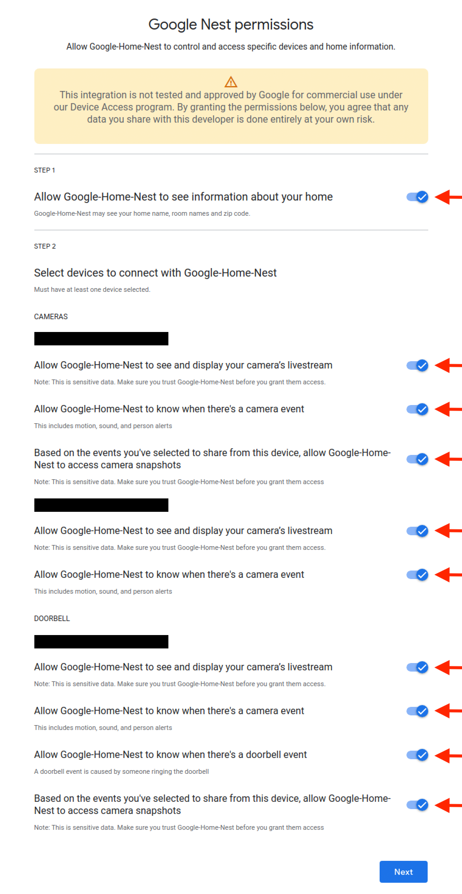

# ioBroker.google-home-nest

> [!NOTE]
> This is the documentation in English. 
> You can find the German version here: [🇩🇪 German documentation](../de/adapter_setup.md)

## Overview **'Admin Panel'**

.png)

|                                                               | Configuration Type         | Description                                                                                                                |
| ------------------------------------------------------------- | -------------------------- | -------------------------------------------------------------------------------------------------------------------------- |
|        | **Basic-Setup**            | The areas marked with red circles in the overview are required for the **Basic-Setup**.  The **Basic-Setup** allows the adapter to query fundamental properties of your Google (Nest) devices and create an object tree for your devices in ioBroker.    |
|  | **Extended-Setup**         | The areas marked with yellow circles in the overview are required for the **Extended-Setup**.  With the **Advanced-Setup**, the adapter can receive (or fetch) **'Event Messages'** and temporarily reflect them in the corresponding ioBroker objects. |

## Basic-Setup

1. For the **Basic Setup**, you first need to select a port for the HTTP-server under point 1.

> [!IMPORTANT]
> Make sure that the selected port is not already being used by another application or process and is not blocked by a firewall.

2. Subsequently, values 2-4 must be entered. How to obtain these values will be described in the following sections. 

3. After entering the required data, you can save them by clicking on **'SAVE'**. 

4. Next, the adapter needs to be started. 
   Immediately after starting, the adapter will attempt to create an HTTP-server that monitors the port specified in step 1 for incoming communication. 

> [!IMPORTANT]
> For the successful completion of the following steps, it is essential that the adapter and thus the HTTP-server have been started, and the HTTP-server is capable of monitoring the specified port.

5. Now, authentication can be initiated by clicking the **'Authenticate'** button in the **'Authentication'** section of the Adapter **'Admin Panel'**.

> [!IMPORTANT]
> To successfully complete the following steps, it is essential that the click on the **'Authenticate'** button is performed in a browser on the same device where ioBroker is installed.

> [!IMPORTANT]
> The **'Authentication'** can only be successfully completed if you are signed in to your browser with the **'Google Account'** associated with your Google (Nest) devices. 
> If you are currently not signed in with any **'Google Account'** in your default browser, you will be prompted to sign in with your **'Google Account'** first after clicking the **'Authenticate'** button. 
> If, however, you receive an error message after clicking the **'Authenticate'** button, please first check if you are currently signed in with the wrong **'Google Account'**.

6. If you are not already signed in with a **'Google Account'**, please sign in now with the **'Google Account'** associated with your Google (Nest) devices. 
   If you are already signed in with the corresponding **'Google Account'**, proceed to the next step.

7. In the next step, you need to grant the adapter permissions to access your Google (Nest) devices. 
   To do this, please enable all options and then click the 'Next' button.
   

> [!NOTE]
> The number of options to be activated here varies based on the number and type of your Google (Nest) devices.
> Accordingly, the screen you see may differ from the screenshot at the top.

> [!TIP]
> Some options may only become available for activation after other options have already been activated. 
> Additionally, it may take a short moment for some options to become activatable.

8. In the following step, you may be prompted again to select your **'Google Account'**. 
   If prompted, please select the **'Google Account'** associated with your Google (Nest) devices.

9. Now you will be notified that the adapter has not been verified by Google. 
   Google requires your consent again here. 
   Click the **'Next'** button to proceed.

10. You may now be prompted again to give your consent.

11. If you now receive the message **'*Authorization Code sent to ioBroker successfully. You can close this tab/window now.*'** in your browser, then everything has worked, and the **'Authorization Code'** has been received by the adapter and stored in ioBroker as an object. 
    Click on the **'SAVE AND CLOSE'** button in the adapter **'Admin Panel'** to complete the **'Basic-Setup'**.

## Extended-Setup

1. For the **'Extended-Setup'**, you first need to enter the **'Google Cloud - Project-ID'** under point 5. 
   If you followed the instructions in the **'Acquiring OAuth-Client-ID & Client Secret'** section, the **'Google Cloud - Project-ID'** was displayed in Step 7 of this section. 
   To have the **'Google Cloud - Project-ID'** displayed again, you can use one of the **'Google Cloud Console'** buttons in the adapter **'Admin Panel'** to reopen the **'Google Cloud Console'**. 
   Once you have selected your corresponding project in the top left corner of the **'Google Cloud Console'**, the **'Google Cloud - Project-ID'** will be displayed to you on the **'Google Cloud Console'**.

2. To receive (or fetch) events, the **'Pub/Sub-Topic'** must be activated on the Google **'Device Access Console'**. 
   If you followed the instructions in the **'Acquiring Project-ID'** section and decided to already activate the events in Step 8 of the section, the **'Pub/Sub-Topic'** should already be activated on the Google **'Device Access Console'**, and you don't need to worry about anything further. 
   Otherwise, please follow the **'Activate Pub/Sub-Topic'** section to activate the **'Pub/Sub-Topic'** on the Google **'Device Access Console'**.

3. Afterwards, the checkbox for **'Enable Events'** (point 6) can be checked.

4. Now you can select the **'Events acquisition method'** under point 7.

> [!WARNING]
> Currently, only **'PULL'** is supported as the **'Events acquisition method**'.

5. Under point 8, you can now define the **'Events Pull timeout'** (in seconds). 
   This timeout specifies how long the adapter waits after the last event retrieval before it starts retrieving the events of the Google (Nest) devices again.

6. Now click on the **'SAVE AND CLOSE'** button in the adapter **'Admin Panel'** to complete the **'Extended-Setup'**.

## Acquiring **'OAuth-Client-ID'** & **'Client Secret'**

To obtain an **'OAuth-Client-ID'**, you first need to create a Google Cloud project.

1. Open the [Google Cloud Console](https://console.cloud.google.com/) in your browser. 
> [!TIP]
> The **'Google Cloud Console'** can also be accessed via the address 'https://console.cloud.google.com/' or by clicking on one of the corresponding buttons in the Adapter **'Admin Panel'**.
