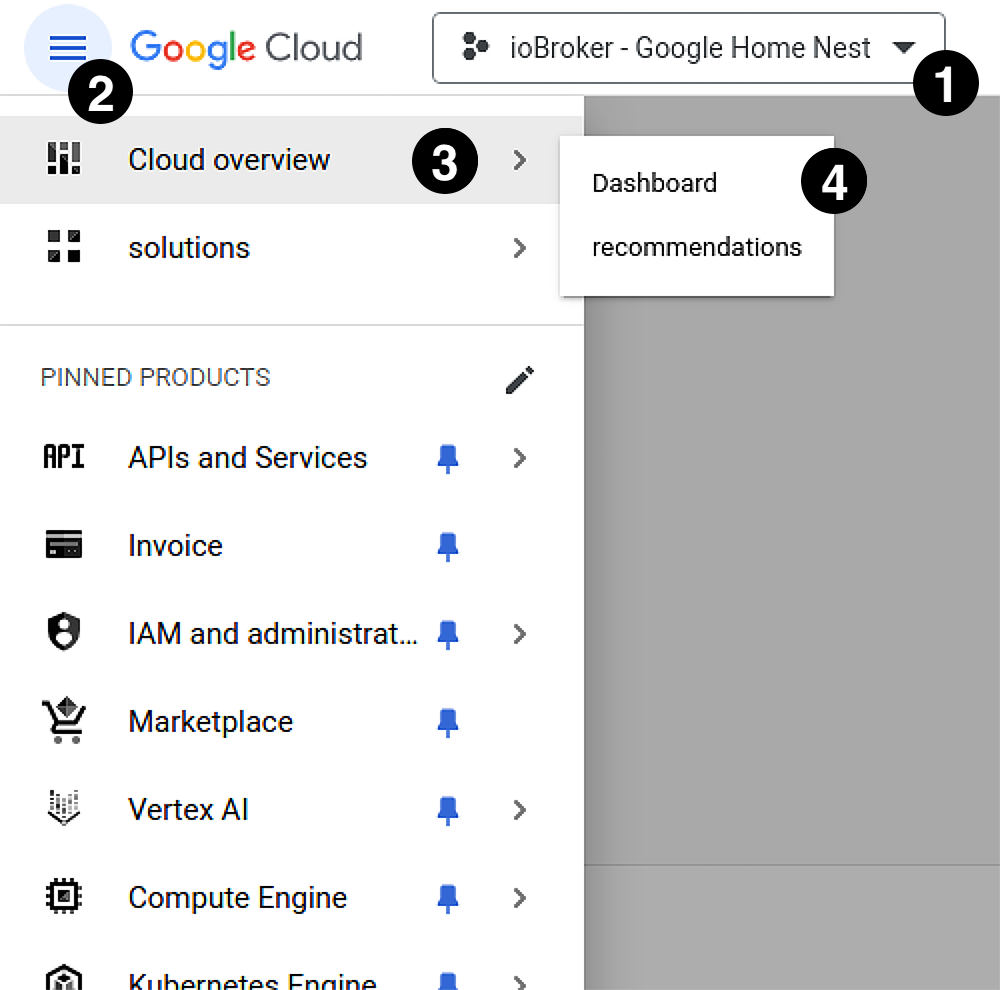
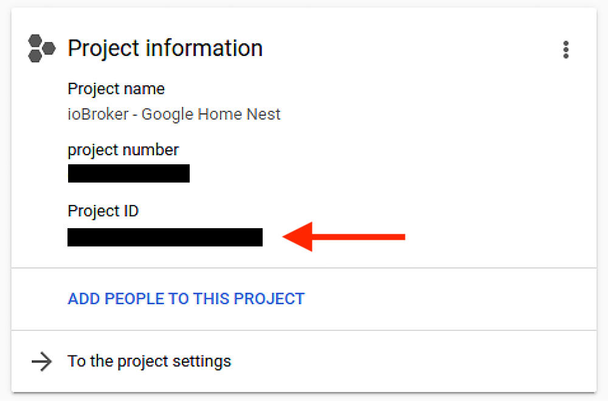
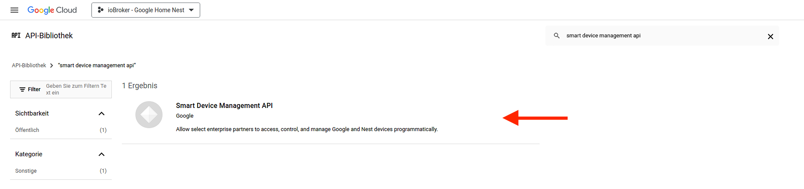

# ioBroker.google-home-nest

> [!NOTE]
> This is the documentation in English. 
> You can find the German version here: [🇩🇪 German documentation](../de/adapter_setup.md)

## Overview **'Admin Panel'**

.png)

|                                                               | Configuration Type         | Description                                                                                                                |
| ------------------------------------------------------------- | -------------------------- | -------------------------------------------------------------------------------------------------------------------------- |
|        | **Basic-Setup**            | The areas marked with red circles in the overview are required for the **Basic-Setup**.  The **Basic-Setup** allows the adapter to query fundamental properties of your Google (Nest) devices and create an object tree for your devices in ioBroker.    |
|  | **Extended-Setup**         | The areas marked with yellow circles in the overview are required for the **Extended-Setup**.  With the **Advanced-Setup**, the adapter can receive (or fetch) **'Event Messages'** and temporarily reflect them in the corresponding ioBroker objects. |

## Basic-Setup

1. For the **Basic Setup**, you first need to select a port for the HTTP-server under point 1.

> [!IMPORTANT]
> Make sure that the selected port is not already being used by another application or process and is not blocked by a firewall.

2. Subsequently, values 2-4 must be entered. How to obtain these values will be described in the following sections. 

3. After entering the required data, you can save them by clicking on **'SAVE'**. 

4. Next, the adapter needs to be started. 
   Immediately after starting, the adapter will attempt to create an HTTP-server that monitors the port specified in step 1 for incoming communication. 

> [!IMPORTANT]
> For the successful completion of the following steps, it is essential that the adapter and thus the HTTP-server have been started, and the HTTP-server is capable of monitoring the specified port.

5. Now, authentication can be initiated by clicking the **'Authenticate'** button in the **'Authentication'** section of the Adapter **'Admin Panel'**.

> [!IMPORTANT]
> To successfully complete the following steps, it is essential that the click on the **'Authenticate'** button is performed in a browser on the same device where ioBroker is installed.

> [!IMPORTANT]
> The **'Authentication'** can only be successfully completed if you are signed in to your browser with the **'Google Account'** associated with your Google (Nest) devices. 
> If you are currently not signed in with any **'Google Account'** in your default browser, you will be prompted to sign in with your **'Google Account'** first after clicking the **'Authenticate'** button. 
> If, however, you receive an error message after clicking the **'Authenticate'** button, please first check if you are currently signed in with the wrong **'Google Account'**.

6. If you are not already signed in with a **'Google Account'**, please sign in now with the **'Google Account'** associated with your Google (Nest) devices. 
   If you are already signed in with the corresponding **'Google Account'**, proceed to the next step.

7. In the next step, you need to grant the adapter permissions to access your Google (Nest) devices. 
   To do this, please enable all options and then click the 'Next' button.
   

> [!NOTE]
> The number of options to be activated here varies based on the number and type of your Google (Nest) devices.
> Accordingly, the screen you see may differ from the screenshot at the top.

> [!TIP]
> Some options may only become available for activation after other options have already been activated. 
> Additionally, it may take a short moment for some options to become activatable.

8. In the following step, you may be prompted again to select your **'Google Account'**. 
   If prompted, please select the **'Google Account'** associated with your Google (Nest) devices.

9. Now you will be notified that the adapter has not been verified by Google. 
   Google requires your consent again here. 
   Click the **'Next'** button to proceed.

10. You may now be prompted again to give your consent.

11. If you now receive the message **'*Authorization Code sent to ioBroker successfully. You can close this tab/window now.*'** in your browser, then everything has worked, and the **'Authorization Code'** has been received by the adapter and stored in ioBroker as an object. 
    Click on the **'SAVE AND CLOSE'** button in the adapter **'Admin Panel'** to complete the **'Basic-Setup'**.

## Extended-Setup

1. For the **'Extended-Setup'**, you first need to enter the **'Google Cloud - Project-ID'** under point 5. 
   If you followed the instructions in the **'Acquiring OAuth-Client-ID & Client Secret'** section, the **'Google Cloud - Project-ID'** was displayed in Step 7 of this section. 
   To have the **'Google Cloud - Project-ID'** displayed again, you can use one of the **'Google Cloud Console'** buttons in the adapter **'Admin Panel'** to reopen the **'Google Cloud Console'**. 
   Once you have selected your corresponding project in the top left corner of the **'Google Cloud Console'**, the **'Google Cloud - Project-ID'** will be displayed to you on the **'Google Cloud Console'**.

2. To receive (or fetch) events, the **'Pub/Sub-Topic'** must be activated on the Google **'Device Access Console'**. 
   If you followed the instructions in the **'Acquiring Project-ID'** section and decided to already activate the events in Step 8 of the section, the **'Pub/Sub-Topic'** should already be activated on the Google **'Device Access Console'**, and you don't need to worry about anything further. 
   Otherwise, please follow the **'Activate Pub/Sub-Topic'** section to activate the **'Pub/Sub-Topic'** on the Google **'Device Access Console'**.

3. Afterwards, the checkbox for **'Enable Events'** (point 6) can be checked.

4. Now you can select the **'Events acquisition method'** under point 7.

> [!WARNING]
> Currently, only **'PULL'** is supported as the **'Events acquisition method**'.

5. Under point 8, you can now define the **'Events Pull timeout'** (in seconds). 
   This timeout specifies how long the adapter waits after the last event retrieval before it starts retrieving the events of the Google (Nest) devices again.

6. Now click on the **'SAVE AND CLOSE'** button in the adapter **'Admin Panel'** to complete the **'Extended-Setup'**.

## Acquiring **'OAuth-Client-ID'** & **'Client Secret'**

To obtain an **'OAuth-Client-ID'**, you first need to create a Google Cloud project.

1. Open the [Google Cloud Console](https://console.cloud.google.com/) in your browser. 
> [!TIP]
> The **'Google Cloud Console'** can also be accessed via the address 'https://console.cloud.google.com/' or by clicking on one of the corresponding buttons in the Adapter **'Admin Panel'**.

2. If you access the **'Google Cloud Console'** for the first time, you will now be prompted to accept the terms of use for the **'Google Cloud Platform'**. 
   

   To proceed, please agree to the terms of use.
> [!IMPORTANT]
> Make sure you are logged in with the same Google account that is linked to your Google (Nest) devices.

3. Next, a new project needs to be created in the **'Google Cloud Console'**. 
   To do this, click on the project selection dropdown menu in the upper section of the **'Google Cloud Console'**.
   

4. Now, in the pop-up window that appears, select **'New Project'** to create a new project.

5. Now, the new project needs to be configured. 

   For this, a valid **'Project name'** and a valid **'Project-ID'** must be assigned. 
    
   The **'Project name'** serves solely to identify the project in your project library. 
   The **'Project-ID'**, on the other hand, identifies your project at a 'global' level and must therefore be unique and cannot be changed afterwards. 
    
   When opening the page for project creation, the **'Project name'** text field already contains a suggestion for the project name. 
   Similarly, a unique **'Project-ID'** is already displayed, which can be changed by clicking the **'EDIT'** button. 
    
   A **'Location'** does not necessarily need to be specified.

   

   After you have chosen a **'Project name'** and assigned a unique **'Project-ID'**, click on the **'CREATE'** button to create the project.

> [!TIP]
> It's advisable to assign a custom **'Project name'** to make it easier to identify the project in the future. 
> For example: 'ioBroker - Google Home Nest' (as seen in the following image).

> [!TIP]
> Since the **'Project-ID'** uniquely identifies your Google Cloud project among all Google Cloud projects, and therefore must be unique among all Google Cloud projects,
> it's advisable to give the **'Project-ID'** a personal component. 
> Your name or parts of your name, your nickname, or your domain (if available) are good examples of personal components for the **'Project-ID'**. 
> However, there's also nothing wrong with simply accepting the proposed **'Project-ID'**. In some cases, this may even be the easiest option.

6. Now, select your newly created project from the dropdown menu and navigate to the **'Dashboard'** of the project. 

   For this, follow steps 1-4 in the image below.

   

7. On the **'Dashboard'** of the project, you will now find your **'Project name'**, your **'Project number'**, and your **'Project-ID'** in the **'Project information'** section.
   

> [!NOTE]
> You will need the **'Project-ID'** for the **Extended-Setup**. It is not required for the **Basic-Setup**.

> [!IMPORTANT]
> The **'Project-ID'** (in the upper image) is the **'Google Cloud - Project-ID'**. 
> Please do not confuse this with the **'Project-ID'** of the Google **'Device Access Console'**, which you need for the **Basic-Setup** and is to be entered in the Adapter **'Admin Panel'** under **point 3**.

8. After successfully creating the project in the **'Google Cloud Console'**, the next step is to activate the **'Smart Device Management API'**. 

   Ensure that your newly created project is selected in the dropdown menu (Step 1 in the lower image) and then follow steps 2-4.

   

9. Now, on the following page, click on **'+ ACTIVATE APIS AND SERVICES'**.
   

10. Use the search bar on the following page to search the Google **'API Library'** for the **'Smart Device Management API'**.
   

11. Select the **'Smart Device Management API'** from the search results.
    

12. On the **'Smart Device Management API'** page, click the **'ACTIVATE'** button to activate the API.
    

13. Now that the **'Smart Device Management API'** is activated, the credentials need to be created. 

    To do this, first click on **'Credentials'** in the menu on the left side to access the corresponding page.
    

14. On the **'Credentials'** page, click the **'+ CREATE CREDENTIALS'** button in the top menu bar, then click on **'OAuth client ID'** (Step 2 in the lower image).
    

15. If you have just created a new project, you will now be shown that before creating an **'OAuth client ID'**, you need to configure the **'Consent Screen'**. 

    You can do this by clicking on the **'CONFIGURE CONSENT SCREEN'** button.

    

16. Now, on the next page, select **'External'** for the **'User Type'** and then click on the **'CREATE'** button.
    

17. On the next page, you now need to provide some information for the **'Consent Screen'**.

    | Point | Field name                                         | mandatory?     | Description                                                                                                                  |
    | ----- | -------------------------------------------------- | -------------- | ---------------------------------------------------------------------------------------------------------------------------- |
    | 1     | App Name                                           | Yes            | Enter a name for the application requesting consent here. For example: *'ioBroker Adapter: Google-Home-Nest'*             |
    | 2     | User support email                                 | Yes            | Select your email address from the dropdown menu, here.                                                                      |
    | 3     | EMail addresses (Developer contact information) | Yes            | Here, you enter your email address again.                                                                                    |
    | 4     | Logo file to upload                                | No             | Here, a logo for the application requesting consent can be uploaded. This is not mandatory and can be skipped. However, if desired, for example, the adapter logo can be uploaded here. You can download the adapter logo from [here](https://github.com/danieldriessen/ioBroker.google-home-nest/blob/main/admin/google-home-nest.png) if needed. |

    Once you have provided all the information, click on the **'SAVE AND CONTINUE'** button to save your settings and proceed to the next screen.

    

18. You can simply skip the next screen by clicking on **'SAVE AND CONTINUE'**.
    

19. On the next screen, a **Test User** needs to be created. 

    To do this, first click on **'+ ADD USER'**.
    

    In the displayed dialog box, a **Google user account** must now be specified.
    
    Then click on the **'ADD'** button in the dialog box, and then on the **'SAVE AND CONTINUE'** button on the main page.

> [!IMPORTANT]
> Make sure to specify the **Google user account** here, which is also linked to your Google (Nest) devices.

20. On the next screen, which displays a summary of the settings made, click on **'BACK TO DASHBOARD'**.
    

21. Now that the **'Consent Screen'** is configured, you can proceed to create your **'Credentials'**. 
    To do this, click on **'Credentials'** again in the left menu bar.
    

22. Now, on the **'Credentials'** page, click the **'+ CREATE CREDENTIALS'** button again in the top menu bar, then click on **'OAuth client ID'** (Step 2 in the lower image).
    

23. On the page for creating the **'OAuth client ID'**, select **'Web application'** from the dropdown menu.
    

24. In the field **'Name'** that appears (which is already pre-filled with '*Web client 1*'), you can now specify the name of the 'application' (the web client) that requests access to the resource.
    

> [!TIP]
> A good name at this point would be, for example: '*ioBroker*'.

25. Next, please click on the **'+ ADD URI'** button.
    

26. Now, another text field **'URI 1'** appears, where the **'Redirect URI'** must be specified. 

    At this point, please enter the following **URI**: **'http://localhost:{HTTP-SERVER-PORT}'**. 
    Replace the **'{HTTP-SERVER-PORT}'** part of the **URI** with the **'HTTP-Server Port'** you configured in the adapter **'Admin Panel'**.
